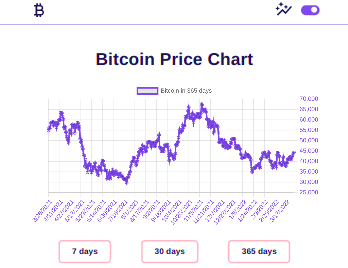

# Bitcoin tracker with ReactJS, TypeScript, ChartJS, Axios and Material UI 🤑
This project shows a chart with bitcoin tracker (chart and profit calculator).
## Enriched with 💎
It was build with ReactJS, TypeScript, ChartJS, Axios and Material UI and using an API. 
 * [ReactJS](https://reactjs.org/);
 * [TypeScript](https://www.typescriptlang.org/);
 * [ChartJS](https://www.chartjs.org/) 💹
 * [Axios](https://axios-http.com/docs/intro);
 * [MaterialUI](https://mui.com/pt/);

To know more about the API: <a href='https://oynv41e6xi.execute-api.us-east-1.amazonaws.com/test'>BITCOIN API</a>
## User story

## Deploy 🚀
To make this project more than http://localhost:3000/ this project is deploying with [firebase](https://firebase.google.com/) 😻